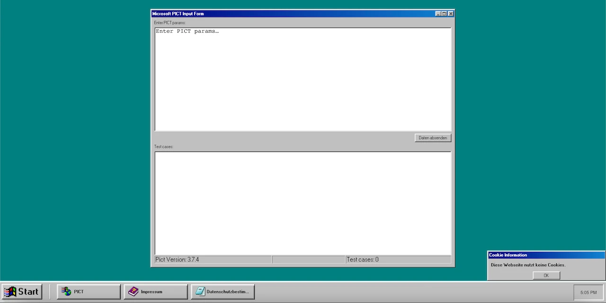

# Pairwise98

Pairwise98 is Microsoft PICT in a Docker container along with a web
frontend.

Please note: The website design mimics Windows 98 and is only
functional on large desktop screens. However, since this project
was only intended as a technical demo for a talk, this is perfectly
fine for the target audience.



This is a private project and is not affiliated with Microsoft.
It simply uses [Microsoft PICT](https://github.com/microsoft/pict),
which was published under the
[MIT License](https://github.com/microsoft/pict/blob/main/LICENSE.TXT)
by Microsoft.

# Quarkus

This project uses Quarkus, the Supersonic Subatomic Java Framework.
To learn more about Quarkus, please visit its website at https://quarkus.io/.

## Build Docker image

A Docker image is pushed to Docker Hub with each CI build and can be found
here: https://hub.docker.com/r/renfis/pict. To build and run the Docker
image locally, execute the following commands:

```shell
docker build -t pict .

docker run --rm -it -p8080:8080 pict
```

Then navigate to `http://localhost:8080` in your favorite desktop browser.

## Running the application in dev mode

You can run your application in dev mode that enables live coding using:

```shell
mvn compile quarkus:dev
```

> **_NOTE:_**  Quarkus now ships with a Dev UI, which is available in dev mode
> only at http://localhost:8080/q/dev/.

## Packaging and running the application

The application can be packaged using:

```shell
mvn package
```

It produces the `quarkus-run.jar` file in the `target/quarkus-app/` directory.
Be aware that it’s not an _über-jar_ as the dependencies are copied into
the `target/quarkus-app/lib/` directory.

The application is now runnable
using `java -jar target/quarkus-app/quarkus-run.jar`.

## Creating a native executable

You can create a native executable using:

```shell
mvn package -Pnative
```

Or, if you don't have GraalVM installed, you can run the native executable build
in a container using:

```shell
mvn package -Pnative -Dquarkus.native.container-build=true
```

You can then execute your native executable
with: `./target/getting-started-1.0.0-SNAPSHOT-runner`

If you want to learn more about building native executables, please
consult https://quarkus.io/guides/maven-tooling.

## Related Guides

- RESTEasy Reactive ([guide](https://quarkus.io/guides/resteasy-reactive)): A
  JAX-RS implementation utilizing build time processing and Vert.x. This
  extension is not compatible with the quarkus-resteasy extension, or any of the
  extensions that depend on it.

## Provided Code

### RESTEasy Reactive

Easily start your Reactive RESTful Web Services

[Related guide section...](https://quarkus.io/guides/getting-started-reactive#reactive-jax-rs-resources)

## Third party resources

Used Windows 98 designs from [98.css](https://jdan.github.io/98.css/) and
[Windows 98 CSS Demo on fjolt.com](https://fjolt.com/article/css-windows-98)
